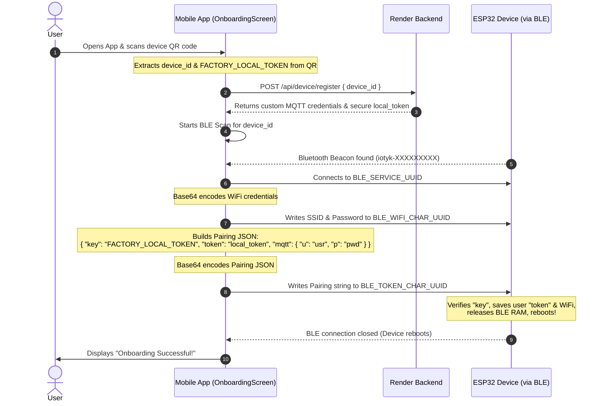
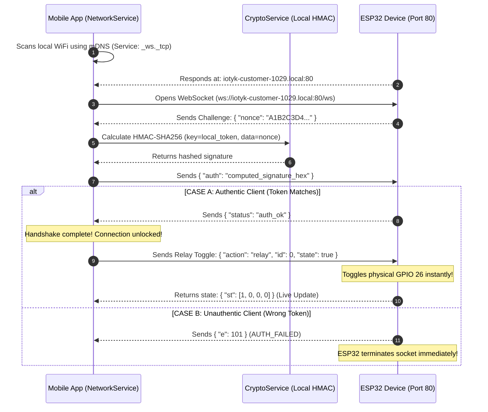

# 📱 IoTYK Mobile Application — Architecture & Onboarding Flow Manual

This manual details the architecture, file modules, connection workflows, and cryptographic schemas of the **IoTYK Mobile Application** (supporting both iOS and Android). It traces how the app conducts dual QR/BLE onboarding and performs secure sub-millisecond local LAN controls.

---

## 🗺️ 1. Complete Mobile App Data Flowchart

This diagram traces the internal layout of the Mobile App, showing how its service modules orchestrate Bluetooth (BLE), LAN WebSockets (WSS), and cloud connectivity.

```mermaid
graph TD
    %% Styling Definitions
    classDef file fill:#1e1e2f,stroke:#4f4f7f,stroke-width:2px,color:#d4d4d4;
    classDef process fill:#1a4d6c,stroke:#2a6d9c,stroke-width:2px,color:#ffffff;
    classDef external fill:#4a1c5a,stroke:#6e2c8a,stroke-width:2px,color:#ffffff;
    classDef payload fill:#5a5a1c,stroke:#8a8a2c,stroke-width:2px,color:#ffffff;

    %% Mobile App Screens (React Native / Flutter)
    subgraph UI Screens & Views
        UI_ONB["OnboardingScreen.js<br/>(QR Scanning & BLE Pairing)"]:::file
        UI_DASH["DashboardScreen.js<br/>(Dynamic Multi-Relay Grid)"]:::file
        UI_SETT["SettingsScreen.js<br/>(Wipe Device & OTA Settings)"]:::file
    end

    %% Mobile App Services (Background Logic)
    subgraph Core Mobile Service Modules
        S_BLE["BluetoothService.js<br/>(NimBLE Scan/Write Core)"]:::file
        S_NET["NetworkService.js<br/>(mDNS Scanner & WS Manager)"]:::file
        S_CRY["CryptoService.js<br/>(Local HMAC-SHA256 Math)"]:::file
        S_CLD["CloudService.js<br/>(Render REST & MQTT Link)"]:::file
    end

    %% External Connections
    subgraph External Devices & Servers
        ESP32_HW["ESP32 Relay Device<br/>(Hardware Module)"]:::external
        REND_CLD["Render Cloud Backend<br/>(Device Registrations)"]:::external
        EMQX_BRK["EMQX Cloud Broker<br/>(MQTTS Remote Link)"]:::external
    end

    %% UI Connections to Services
    UI_ONB -->|Triggers QR scan & BLE pair| S_BLE
    UI_DASH -->|Triggers LAN toggle| S_NET
    UI_DASH -->|Fallback cloud toggle| S_CLD
    UI_SETT -->|Triggers OTA/Factory Wipe| S_CLD

    %% Service Interaction
    S_NET -->|Computes auth signature| S_CRY
    S_BLE -->|1. Over-the-air BLE provisioning| ESP32_HW
    S_NET -->|2. Local WS over LAN (Port 80)| ESP32_HW

    %% Cloud Integration
    S_CLD -->|3. POST /device/register| REND_CLD
    S_CLD -->|4. Secure MQTTS (Broker TLS)| EMQX_BRK
    EMQX_BRK -->|5. Remote Cloud Control| ESP32_HW
```

---

## 📂 2. Recommended Mobile App Directory Layout (React Native / Expo)

A highly structured, modular layout to handle heavy Bluetooth and cryptographic background services:

```text
iotyk-mobile-app/
├── package.json               # Native dependencies (react-native-ble-plx, crypto-js, zero-conf)
├── App.js                     # Root entry and theme provider
├── src/
│   ├── screens/
│   │   ├── OnboardingScreen.js # Dual QR/BLE scan and onboarding setup
│   │   ├── DashboardScreen.js  # Main control grid (relays 1, 2, or 4)
│   │   └── SettingsScreen.js   # Reset options & details
│   ├── services/
│   │   ├── BluetoothService.js # BLE core discovery, read/writes (base64)
│   │   ├── NetworkService.js   # mDNS zeroconf scanner & WebSocket listener
│   │   ├── CryptoService.js    # Performs local HMAC-SHA256 hash logic
│   │   └── CloudService.js     # Interfaces with your Render REST API and cloud broker
│   └── components/
│       └── RelayToggleCard.js  # Micro-animated, premium glassmorphism relay toggles
```

---

## 🛜 3. Detailed Dual-Discovery Onboarding Flow (QR & BLE)

This sequence maps how the Mobile App securely registers a blank device and sends WiFi details using Bluetooth:



---

## 🌐 4. LAN Auto-Discovery & Authenticated Local control (WSS)

When the phone and ESP32 are connected to the same home router, they bypass the cloud entirely for lightning-fast **local control**:



---

## ⚡ 5. Mobile App JSON Payloads (Quick Reference)

### 📤 5.1. Onboarding JSON Payload written to BLE Characteristic
Before sending, the app must convert this payload to a flat, minified JSON string and **Base64 encode** it:
```json
{
  "key": "iotyk-factory-initial-key-2026",
  "token": "secure_local_token_generated_by_render",
  "mqtt": {
    "u": "customer_mqtt_user",
    "p": "customer_mqtt_pass"
  }
}
```

### 📥 5.2. Local WebSocket Handshake (Incoming Nonce)
The raw string received by the app's WS listener upon opening the connection:
```json
{
  "nonce": "e3b0c44298fc1c149afbf4c8996fb924"
}
```

### 📤 5.3. Local WebSocket Authorization (Outgoing Signature)
The calculated response payload sent back to the ESP32:
```json
{
  "auth": "65b9e8a71234bcdef90123456789abcd65b9e8a71234bcdef90123456789abcd"
}
```
*(Calculated using native crypto libraries like `crypto-js` or `react-native-quick-crypto` inside the mobile code).*
