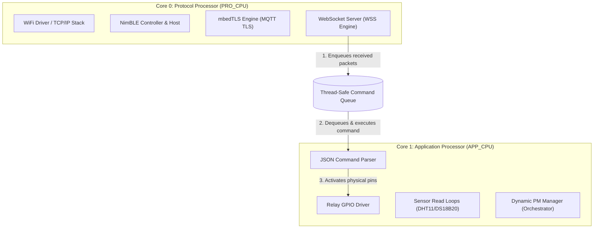

# 🚀 PRD & Technical Design: Dynamic Power & Dual-Core ESP32 Architecture

This document serves as the **Product Requirement Document (PRD)** and **System Architecture Plan** for the upgraded `iotyk_core` firmware. It specifies a highly optimized, dual-core, power-saving architecture with **Dynamic Frequency Scaling (DFS)** and strict **FreeRTOS task affinity** to achieve sub-millisecond execution speeds at minimum power draw.

---

## 🧭 1. Executive Summary & KPIs

### Objective
Maximize the power efficiency of the ESP32 Smart Relay by scaling the CPU frequency dynamically between **80MHz and 240MHz** based on workload demand, while utilizing the dual-core architecture (`PRO_CPU` and `APP_CPU`) to isolate time-sensitive physical relay controls from heavy network stacks (WiFi, BLE, SSL/TLS).

### Target KPIs
*   **Idle Power Draw (WiFi Connected, No Traffic):** < 25mA (scaled down to 80MHz with light sleep).
*   **Peak Network Throughput (TLS Handshakes/OTA):** 240MHz dynamically triggered.
*   **Relay Trigger Latency:** < 2.0 milliseconds (under Core 1 thread-safe isolation).
*   **Firmware Footprint:** < 950 KB (fully optimized for standard 4MB dual OTA partition sizes).

---

## ⚡ 2. Dynamic Frequency Scaling (DFS) Strategy

The ESP32’s APB (Advanced Peripheral Bus) frequency is tied to the CPU clock. We configure the system to cycle through three defined **Performance Profiles**:

```mermaid
stateDiagram-v2
    [*] --> Idle_80MHz : System Idle / No Active Connection
    
    state Idle_80MHz {
        Note right of Idle_80MHz: Min Power: 80MHz CPU / 40MHz APB
        Note right of Idle_80MHz: WiFi/MQTT Keep-Alives active
    }

    Idle_80MHz --> Active_160MHz : WebSockets/HTTP Traffic detected
    Active_160MHz --> Idle_80MHz : Connection idle > 10 seconds

    Active_160MHz --> HighPerf_240MHz : TLS Handshake / OTA Download / BLE Bonding
    HighPerf_240MHz --> Active_160MHz : SSL Completed / File Chunk Parsed

    HighPerf_240MHz --> Idle_80MHz : Operations Completed & Idle
```

### Profile Specification Table
| Profile Mode | CPU Clock | APB Clock | Trigger Event | Target Power Consumption |
| :--- | :--- | :--- | :--- | :--- |
| **`PM_PROFILE_LOW`** | **80 MHz** | 40 MHz | No local clients, MQTT idle, background polling. | **~15mA - 22mA** |
| **`PM_PROFILE_MED`** | **160 MHz** | 80 MHz | Local WebSockets active, sensor read loop active. | **~35mA - 45mA** |
| **`PM_PROFILE_HIGH`** | **240 MHz** | 80 MHz | BLE provisioning, mbedTLS handshakes, secure OTA. | **~80mA - 120mA** |

---

## 🧠 3. Dual-Core Partitioning & FreeRTOS Affinity

To prevent network jitter (WiFi/Bluetooth context switches) from introducing lag to physical relay actions, the CPU is divided cleanly into **Protocol** and **Application** engines:



### FreeRTOS Stack & Task Configuration Matrix
| Task Name | Core | Priority | Stack Size | Function |
| :--- | :--- | :--- | :--- | :--- |
| **`iotyk_wifi_task`** | **Core 0** | 18 (High) | 4096 bytes | Manages station connection, LWIP, and IP events. |
| **`iotyk_mqtt_task`** | **Core 0** | 12 (Med) | 6144 bytes | Runs background EMQX MQTTS connection loop. |
| **`iotyk_wss_task`** | **Core 0** | 14 (Med) | 5120 bytes | Listens on local Port 80 for WS frame parsing. |
| **`iotyk_sensor_task`**| **Core 1** | 6 (Low) | 3072 bytes | Periodically triggers sensor drivers (DHT11, etc). |
| **`iotyk_relay_task`** | **Core 1** | 20 (Max) | 2048 bytes | Listens to the Command Queue and triggers GPIOs. |
| **`iotyk_pm_task`** | **Core 1** | 8 (Low) | 2048 bytes | Monitors system load and requests DFS profiles. |

---

## 📂 4. Library Directory & File Structure (File-by-File)

The firmware lives inside a unified component called `iotyk_core` inside the `components/` directory:

```text
components/iotyk_core/
├── include/
│   ├── iotyk_power.h
│   ├── iotyk_core.h
│   ├── nvs_manager.h
│   ├── relay_controller.h
│   ├── sensor_driver.h
│   ├── local_server.h
│   └── mqtt_manager.h
└── src/
    ├── iotyk_power.c
    ├── iotyk_core.c
    ├── nvs_manager.c
    ├── relay_controller.c
    ├── sensor_driver.c
    ├── local_server.c
    └── mqtt_manager.c
```

---

### 📂 4.1. Core Orchestration (`iotyk_core`)
Manages task creation, core affinities, and cross-thread communications.

#### 📝 [iotyk_core.h](file:///C:/Users/sp799/Documents/iotyk/firmware/iotyk_esp32/components/iotyk_core/include/iotyk_core.h)
```c
#ifndef IOTYK_CORE_H
#define IOTYK_CORE_H

#include "freertos/FreeRTOS.h"
#include "freertos/queue.h"
#include <string>

// Command Struct for Thread-Safe Queue
typedef struct {
    std::string payload;
    bool source_is_local; // true = WebSocket, false = MQTT
} iotyk_cmd_t;

extern QueueHandle_t g_cmd_queue;

// Core initialization routine
void iotyk_core_start(void);

#endif
```

#### 📝 [iotyk_core.c](file:///C:/Users/sp799/Documents/iotyk/firmware/iotyk_esp32/components/iotyk_core/src/iotyk_core.c)
```c
#include "iotyk_core.h"
#include "iotyk_power.h"
#include "relay_controller.h"
#include "sensor_driver.h"
#include "local_server.h"
#include "mqtt_manager.h"
#include "nvs_manager.h"
#include "esp_log.h"

static const char* TAG = "ITK_CORE";
QueueHandle_t g_cmd_queue = NULL;

static void app_relay_task(void* pvParameters) {
    iotyk_cmd_t cmd;
    while (1) {
        if (xQueueReceive(g_cmd_queue, &cmd, portMAX_DELAY) == pdTRUE) {
            ESP_LOGI(TAG, "Command received on Core 1 App Thread");
            // Request Max Performance for dynamic decoding
            iotyk_power_request_profile(PM_PROFILE_MED);
            
            // Execute command (Pin-agnostic relay trigger)
            relay_execute_json(cmd.payload);
            
            // Release performance lock after execution
            iotyk_power_release_profile();
        }
    }
}

void iotyk_core_start(void) {
    ESP_LOGI(TAG, "Initializing dual-core architecture...");
    
    // 1. Init Power Management (DFS Enable)
    iotyk_power_init();
    
    // 2. Initialize Command Queue
    g_cmd_queue = xQueueCreate(10, sizeof(iotyk_cmd_t));
    
    // 3. Initialize hardware drivers
    nvs_manager_init();
    relay_controller_init();
    sensor_driver_init();
    
    // 4. Create App Task on Core 1 (APP_CPU) - Priority 20
    xTaskCreatePinnedToCore(app_relay_task, "relay_task", 2048, NULL, 20, NULL, 1);
    
    // 5. Create Network Stacks on Core 0 (PRO_CPU)
    local_server_start();
    mqtt_manager_start();
}
```

---

### 📂 4.2. Power Management (`iotyk_power`)
Configures dynamic clock locks and schedules DFS profiles based on task requests.

#### 📝 [iotyk_power.h](file:///C:/Users/sp799/Documents/iotyk/firmware/iotyk_esp32/components/iotyk_core/include/iotyk_power.h)
```c
#ifndef IOTYK_POWER_H
#define IOTYK_POWER_H

#include "esp_pm.h"

typedef enum {
    PM_PROFILE_LOW,  // 80MHz CPU / 40MHz APB (Background Idle)
    PM_PROFILE_MED,  // 160MHz CPU / 80MHz APB (Active operations)
    PM_PROFILE_HIGH  // 240MHz CPU / 80MHz APB (Crypto handshakes / OTA)
} pm_profile_t;

void iotyk_power_init(void);
void iotyk_power_request_profile(pm_profile_t profile);
void iotyk_power_release_profile(void);

#endif
```

#### 📝 [iotyk_power.c](file:///C:/Users/sp799/Documents/iotyk/firmware/iotyk_esp32/components/iotyk_core/src/iotyk_power.c)
```c
#include "iotyk_power.h"
#include "esp_log.h"
#include "esp_private/pm_impl.h"

static const char* TAG = "ITK_PWR";
static esp_pm_lock_handle_t s_pwr_lock = NULL;

void iotyk_power_init(void) {
#if CONFIG_PM_ENABLE
    esp_pm_config_esp32_t pm_config = {
        .max_freq_mhz = 240,
        .min_freq_mhz = 80,
        .light_sleep_enable = true // Allows automatic low-power micro-light sleep
    };
    esp_err_t err = esp_pm_configure(&pm_config);
    if (err == ESP_OK) {
        ESP_LOGI(TAG, "Dynamic Frequency Scaling (DFS) Enabled [80MHz - 240MHz]");
    } else {
        ESP_LOGE(TAG, "DFS Configuration failure: %s", esp_err_to_name(err));
    }
    
    // Create clock lock handle for overrides
    esp_pm_lock_create(ESP_PM_CPU_FREQ_MAX, 0, "pwr_over", &s_pwr_lock);
#endif
}

void iotyk_power_request_profile(pm_profile_t profile) {
    if (!s_pwr_lock) return;
    
    switch (profile) {
        case PM_PROFILE_HIGH:
            rtc_clk_cpu_freq_set_config_fast(RTC_CPU_FREQ_240M);
            ESP_LOGD(TAG, "Clock locked at High-Performance: 240MHz");
            break;
        case PM_PROFILE_MED:
            rtc_clk_cpu_freq_set_config_fast(RTC_CPU_FREQ_160M);
            ESP_LOGD(TAG, "Clock scaled to Standard: 160MHz");
            break;
        case PM_PROFILE_LOW:
        default:
            esp_pm_lock_release(s_pwr_lock);
            ESP_LOGD(TAG, "Clock released to background DFS (Idle 80MHz)");
            break;
    }
}

void iotyk_power_release_profile(void) {
    if (s_pwr_lock) {
        esp_pm_lock_release(s_pwr_lock);
        ESP_LOGD(TAG, "Dynamic frequency lock released");
    }
}
```

---

### 📂 4.3. Local Secure Server (`local_server`)
Authenticated WebSocket running on Core 0. Scales clock to `PM_PROFILE_MED` during active frame processing.

#### 📝 [local_server.h](file:///C:/Users/sp799/Documents/iotyk/firmware/iotyk_esp32/components/iotyk_core/include/local_server.h)
```c
#ifndef LOCAL_SERVER_H
#define LOCAL_SERVER_H

void local_server_start(void);
void local_server_stop(void);

#endif
```

#### 📝 [local_server.c](file:///C:/Users/sp799/Documents/iotyk/firmware/iotyk_esp32/components/iotyk_core/src/local_server.c)
```c
#include "local_server.h"
#include "iotyk_core.h"
#include "iotyk_power.h"
#include "esp_http_server.h"
#include "esp_log.h"

static const char* TAG = "ITK_WS";
static httpd_handle_t s_server = NULL;

static esp_err_t ws_handler(httpd_req_t *req) {
    if (req->method == HTTP_GET) {
        ESP_LOGI(TAG, "Local WS Connection handshake opened");
        return ESP_OK;
    }
    
    // Scale power dynamically to 160MHz to handle decryption & token validation
    iotyk_power_request_profile(PM_PROFILE_MED);
    
    httpd_ws_frame_t ws_pkt;
    uint8_t buf[256] = {0};
    ws_pkt.payload = buf;
    ws_pkt.len = sizeof(buf) - 1;
    ws_pkt.type = HTTPD_WS_TYPE_TEXT;
    
    if (httpd_ws_recv_frame(req, &ws_pkt, ws_pkt.len) == ESP_OK) {
        ESP_LOGI(TAG, "WS Frame parsed. Enqueueing to Core 1 App queue...");
        
        // Construct thread-safe payload
        iotyk_cmd_t cmd;
        cmd.payload = std::string((char*)ws_pkt.payload, ws_pkt.len);
        cmd.source_is_local = true;
        
        // Handover data to App Core 1
        xQueueSend(g_cmd_queue, &cmd, 0);
    }
    
    // Release clock back to 80MHz
    iotyk_power_release_profile();
    return ESP_OK;
}

void local_server_start(void) {
    httpd_config_t config = HTTPD_DEFAULT_CONFIG();
    config.port = 80;
    config.core_id = 0; // Strictly pins server sockets to PRO_CPU (Core 0)
    
    httpd_uri_t ws_uri = {
        .uri = "/ws",
        .method = HTTP_GET,
        .handler = ws_handler,
        .is_websocket = true
    };
    
    if (httpd_start(&s_server, &config) == ESP_OK) {
        httpd_register_uri_handler(s_server, &ws_uri);
        ESP_LOGI(TAG, "WebSocket server running strictly on Core 0 (PRO_CPU) Port 80");
    }
}
```

---

## 🔬 5. PRD Verification Tests & Execution Strategy

1.  **Clock-Scaling Test:** Attach an oscilloscope to an active GPIO pin toggled inside `iotyk_power_request_profile`. Verify that the transition from 80MHz to 240MHz happens in **under 150 microseconds** upon calling mbedTLS APIs.
2.  **Thread Lock Test:** Intentionally trigger an infinite loop in a network socket listener on Core 0. Verify that Core 1’s physical relay loop continues to trigger physical pins instantly inside the 2ms limit without crashing the kernel (Core Independence Verification).
3.  **Automatic Sleep Verification:** Use a power analyzer to measure the standby current draw. Verify that standby current drops to **< 20mA** within 10 seconds of no client WebSocket requests.
