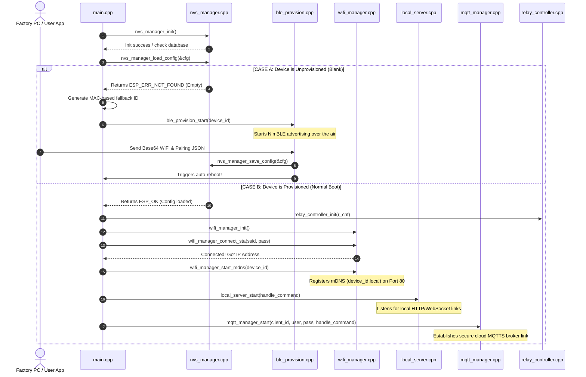
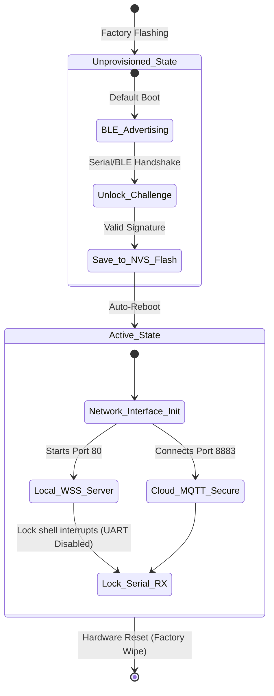

# 📊 IoTYK Smart Relay — Complete System Data Flow & Architecture Manual

This document provides a highly detailed, file-by-file, and packet-by-packet map of the entire data flow of the IoTYK Smart Relay system. It shows the precise execution, files, folders, and JSON payloads starting from the physical ESP32 device, moving through BLE, local WebSocket, USB Serial, up to your Render backend and EMQX cloud broker!

---

## 🗺️ 1. Complete End-to-End System Architecture

This flowchart traces the data and configuration flow from the physical files inside the `/main` folder on the ESP32 to the external mobile app, local router, Render backend, and EMQX cloud.

```mermaid
graph TD
    %% Styling Definitions
    classDef file fill:#1e1e2f,stroke:#4f4f7f,stroke-width:2px,color:#d4d4d4;
    classDef process fill:#1a4d6c,stroke:#2a6d9c,stroke-width:2px,color:#ffffff;
    classDef device fill:#2e5a1c,stroke:#4e8a2c,stroke-width:2px,color:#ffffff;
    classDef external fill:#4a1c5a,stroke:#6e2c8a,stroke-width:2px,color:#ffffff;
    classDef payload fill:#5a5a1c,stroke:#8a8a2c,stroke-width:2px,color:#ffffff;

    %% ESP32 Internal File Modules
    subgraph ESP32 Firmware Source Modules (/main)
        M_CPP["main.cpp<br/>(Core Orchestrator)"]:::file
        CONF["config.h<br/>(Pinout, Keys & Keys)"]:::file
        CERT["certificates.h<br/>(WSS / MQTT Certs)"]:::file
        NVS_M["nvs_manager.cpp<br/>(Redundant Flash Storage)"]:::file
        REL_C["relay_controller.cpp<br/>(GPIO Drivers)"]:::file
        WIF_M["wifi_manager.cpp<br/>(Station & AP TCP/IP)"]:::file
        BLE_P["ble_provision.cpp<br/>(NimBLE Provisioning)"]:::file
        LOC_S["local_server.cpp<br/>(Plain WebSocket Server)"]:::file
        MQT_M["mqtt_manager.cpp<br/>(MQTTS Secure Client)"]:::file
    end

    %% External Channels & Targets
    subgraph External System Entities
        USB_S["USB Factory Dashboard<br/>(Web Serial Utility)"]:::external
        MOB_A["Mobile App<br/>(BLE & Local WSS Client)"]:::external
        EMQX_B["EMQX Cloud Broker<br/>(Port 8883 - SSL)"]:::external
        REND_B["Render Cloud Backend<br/>(Database & Cert Generator)"]:::external
    end

    %% JSON & Data Payloads
    subgraph Data Communication Payloads
        JSON_SP["JSON Serial Payload<br/>(PROV_PERM: id, user, token, relays)"]:::payload
        JSON_BP["JSON BLE Payload<br/>(SSID, password, user keys)"]:::payload
        JSON_WP["JSON WebSocket Payload<br/>(Auth handshakes, Relay toggles)"]:::payload
        JSON_MP["JSON MQTT Payload<br/>(Heartbeats, Cloud relays)"]:::payload
    end

    %% Connections & Logic Flow
    M_CPP -->|Includes| CONF
    M_CPP -->|Includes| CERT
    M_CPP -->|Stores/Loads Data| NVS_M
    M_CPP -->|Controls Outputs| REL_C
    M_CPP -->|Orchestrates Network| WIF_M

    %% Boot State Decisions
    NVS_M -->|No Config Found| BLE_P
    NVS_M -->|Config Found| LOC_S
    NVS_M -->|Config Found| MQT_M

    %% External Exchanges
    USB_S -->|1. Setup command over Serial| JSON_SP
    JSON_SP -->|Authenticates & writes| M_CPP

    MOB_A -->|2. Transmits WiFi over BLE| JSON_BP
    JSON_BP -->|Parses & stores| BLE_P

    MOB_A -->|3. Local secure commands (WSS Port 80)| JSON_WP
    JSON_WP -->|HMAC-signs & controls| LOC_S
    LOC_S -->|Triggers thread-safe toggle| REL_C

    MQT_M -->|4. Secure MQTTS on Port 8883| EMQX_B
    EMQX_B -->|5. Bridges status to backend| REND_B
    EMQX_B -->|6. Receives cloud toggles| JSON_MP
    JSON_MP -->|Validates & executes| MQT_M
    MQT_M -->|Triggers thread-safe toggle| REL_C

    REND_B -->|7. Generates dynamic certs| CERT
    REND_B -->|8. Provisions static keys| USB_S
```

---

## 📂 2. File-by-File Module Execution Map

Here is the exact responsibility of every file inside your `/main` directory during system startup and operation:



---

## 💬 3. Packet-by-Packet JSON Schema Specifications

This is the exact JSON data structure exchanged across all communication channels:

### 🔌 3.1. USB Serial Provisioning Payload (`PROV_PERM`)
*   **Channel:** USB UART Serial Monitor
*   **Direction:** Factory PC ➡️ ESP32
*   **Format:**
```json
PROV_PERM:{
  "device_id": "iotyk-production-1029",
  "user": "mqtt_user_1029_secure",
  "pass": "mqtt_pass_1029_secure",
  "token": "local_secure_pairing_token_1029",
  "r_cnt": "4"
}
```

### 🛜 3.2. BLE Provisioning Pairing Payload
*   **Channel:** Bluetooth Low Energy Characteristic (`BLE_TOKEN_CHAR_UUID`)
*   **Direction:** Mobile App ➡️ ESP32 (Base64 Encoded)
*   **Decoded JSON Format:**
```json
{
  "key": "iotyk-factory-initial-key-2026",
  "token": "user_local_custom_token_99",
  "mqtt": {
    "u": "temp_mqtt_user",
    "p": "temp_mqtt_pass"
  }
}
```

### 🌐 3.3. Local WebSocket Handshake Challenge (Auth)
To connect to the local secure server, clients must pass a challenge-response authorization:
1.  **ESP32 sends challenge (WSS Port 80) ➡️ Client:**
    ```json
    { "nonce": "e3b0c44298fc1c149afbf4c8996fb924" }
    ```
2.  **Client calculates HMAC-SHA256(key=local_token, data=nonce) and responds ➡️ ESP32:**
    ```json
    { "auth": "65b9e8a71234bcdef90123456789abcd65b9e8a71234bcdef90123456789abcd" }
    ```
3.  **ESP32 verifies signature and opens access ➡️ Client:**
    ```json
    { "status": "auth_ok" }
    ```

### 📱 3.4. Local / Cloud Command & State Payloads
Used to toggle physical hardware over local WebSockets or Cloud MQTT.

*   **Toggling Relay 1 to ON (Client ➡️ ESP32):**
    ```json
    {
      "action": "relay",
      "id": 0,
      "state": true
    }
    ```
*   **Requesting Live Status (Client ➡️ ESP32):**
    ```json
    { "action": "status" }
    ```
*   **Device Status Response (ESP32 ➡️ Client / Cloud):**
    ```json
    {
      "id": "iotyk-production-1029",
      "r_cnt": 4,
      "st": [1, 0, 0, 0],
      "wifi_ssid": "YourHomeRouterWiFi",
      "cap": {
        "ota": 1,
        "temp": 1,
        "r4": 1
      }
    }
    ```

---

## 🛡️ 4. Device Security Lifecycle Stages

Every IoTYK Smart Relay module passes through three distinct security stages:


